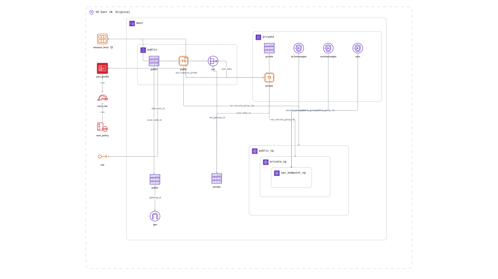

## Basic VPC (AWS)

This Terraform configuration provisions a basic, production-leaning VPC with one public and one private subnet, an Internet Gateway, a NAT Gateway for private egress, two EC2 instances (public and private) running a hardened Apache server that serves their IPs, VPC Flow Logs, CloudTrail, and CloudWatch alarms and dashboards. It also enables Systems Manager (SSM) access for the private instance through interface VPC endpoints.

### What gets created
- **VPC** with DNS support/hostnames enabled
- **Public subnet** and **private subnet** in a single AZ (configurable)
- **Internet Gateway**, **NAT Gateway** and route tables for public/private egress
- **EC2 instances**:
  - Public instance in the public subnet
  - Private instance in the private subnet
  - Both run Apache with security headers; public instance curls the private one for demo
- **Security Groups** for least-privilege access between instances
- **VPC Flow Logs** to CloudWatch Logs
- **CloudTrail** with secure S3 bucket (versioning, encryption, public access block)
- **CloudWatch** alarms (CPU, NetworkIn, StatusCheck) and a simple dashboard
- **SNS** topic for alarm notifications
- **SSM** role/instance profile and VPC interface endpoints for SSM, EC2Messages, SSMMessages

> Note: Remote state is configured in `backend.tf` to an S3 bucket. Ensure it exists or adjust before running.

### Prerequisites
- Terraform v1.3+
- AWS credentials configured
- Existing S3 bucket for the backend (or edit `backend.tf`)

### Quick start
```bash
cd basic-vpc

# Initialize (ensure S3 backend in backend.tf exists or update it)
terraform init

# Review changes
terraform plan -out tfplan

# Apply
terraform apply tfplan
```

### Access and test
- The public instance exposes HTTP on port 80 from `allowed_http_cidrs`. Visit its public IP.
- The public instance also curls the private instance on port 80 at boot; see `/tmp/private_ip_response.log` on the public instance.
- Use SSM Session Manager to connect to the private instance (no bastion required) once SSM agent registers.

### Inputs
- `vpc_cidr` (string) – Default: `10.0.0.0/16`
- `public_subnet_cidr` (string) – Default: `10.0.1.0/24`
- `private_subnet_cidr` (string) – Default: `10.0.2.0/24`
- `availability_zone` (string) – Default: `us-east-1a`
- `environment` (string) – Default: `dev`
- `allowed_http_cidrs` (list(string)) – Default: `["0.0.0.0/0"]` (restrict in production)
- `allowed_ssh_cidrs` (list(string)) – Default: `["0.0.0.0/0"]` (restrict in production)

### Outputs
- `public_instance_public_ip`
- `public_instance_private_ip`
- `private_instance_private_ip`

### Module/resource flow
- `aws_vpc` with Flow Logs to `aws_cloudwatch_log_group.vpc_flow_log`
- `aws_cloudtrail` with secure S3 bucket and policy
- Subnets, route tables, and associations for public/private routing
- NAT with `aws_eip` and `aws_nat_gateway`
- Security groups for public/private instances with minimal ingress
- EC2 instances (Amazon Linux 2) with encrypted gp3 root volumes and hardened Apache
- CloudWatch alarms (CPU/NetworkIn/StatusCheck) sending to SNS
- CloudWatch dashboard for quick visibility
- SSM role/profile and interface VPC endpoints for private access without Internet

### Remote state
Defined in `backend.tf`:
```hcl
backend "s3" {
  bucket = "my-terraform-state-bucket-381492134996"
  key    = "terraform-playground-basic-vpc.tfstate"
  region = "us-east-1"
}
```
Make sure this bucket exists and you have access, or update the values before `terraform init`.

### Destroy
```bash
terraform destroy
```

### Security notes
- Narrow `allowed_http_cidrs` and `allowed_ssh_cidrs`
- Consider multi-AZ subnets and ALB/NLB for public ingress
- Rotate credentials and monitor CloudWatch alarms/SNS destinations

### Diagram
