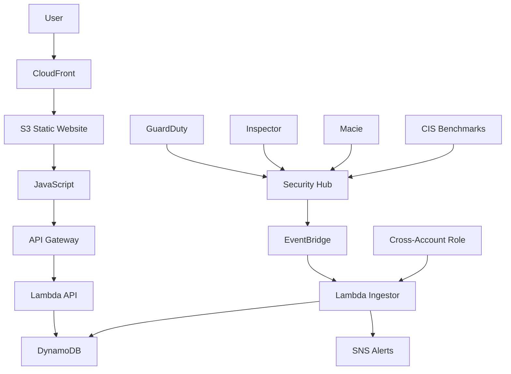

# AWS CSPM Monitor

A web application for monitoring Cloud Security Posture Management (CSPM) in AWS, built with Terraform infrastructure as code.

## Overview

This project demonstrates advanced Terraform skills by deploying a serverless CSPM monitoring solution that leverages AWS Security Hub for comprehensive security findings:

- **Integrates with AWS Security Hub** to ingest findings from GuardDuty, Inspector, Macie, and other security services
- **Enables CIS AWS Foundations Benchmark** compliance checks
- Stores processed findings in DynamoDB for efficient querying
- Provides a real-time dashboard via S3 and CloudFront
- Sends alerts for high-severity issues via SNS
- Supports multi-account scanning with cross-account IAM roles
- Event-driven architecture using EventBridge for real-time processing

## Architecture

## Features

- **Security Hub Integration**: Leverages AWS Security Hub for comprehensive security findings from GuardDuty, Inspector, Macie, and other services
- **CIS Compliance**: Enables CIS AWS Foundations Benchmark v1.4.0 for automated compliance checks
- **Event-Driven Processing**: Real-time ingestion of security findings via EventBridge
- **Real-time Dashboard**: Web interface showing security findings and statistics
- **Intelligent Alerting**: SNS notifications for high/critical severity security issues
- **Multi-Account Support**: Cross-account IAM roles for organization-wide scanning
- **Serverless Architecture**: Cost-effective, scalable solution using AWS Lambda
- **Rich Finding Data**: Preserves detailed information including remediation guidance and compliance status

## Prerequisites

- Terraform CLI
- AWS CLI configured with appropriate permissions
- Python 3.9 for Lambda functions
- **AWS Security Hub enabled** in your account
- **CIS AWS Foundations Benchmark subscription** (automatically enabled by Terraform)
- Optional: GuardDuty, Inspector, Macie enabled for comprehensive findings

## Deployment

1. Clone the repository
2. Update backend.tf with your S3 bucket for Terraform state
3. Update variables as needed
4. Run `terraform init`
5. Run `terraform plan`
6. Run `terraform apply`

## Usage

- Access the dashboard via the CloudFront URL
- Findings are automatically updated every hour
- Alerts are sent to the configured SNS topic

## Security Findings Sources

The system ingests findings from AWS Security Hub, which aggregates security data from:

- **AWS GuardDuty**: Threat detection and monitoring
- **Amazon Inspector**: Automated vulnerability assessments
- **Amazon Macie**: Data security and privacy
- **AWS Config**: Resource compliance monitoring
- **CIS AWS Foundations Benchmark**: Industry-standard security best practices
- **PCI DSS**: Payment card industry compliance checks
- **Additional Security Services**: Firewall Manager, Systems Manager, and more

## Processed Finding Types

- **Critical/High Severity**: Immediate alerts via SNS
- **Compliance Violations**: CIS benchmark rule failures
- **Resource Misconfigurations**: Security group rules, encryption settings
- **Threat Intelligence**: Suspicious activity and malware detection
- **Vulnerability Assessments**: Software vulnerabilities and CVEs

## Cost Considerations

- Lambda: ~$0.20 per 1M requests
- DynamoDB: Pay per request
- API Gateway: ~$3.50 per million requests
- CloudFront: ~$0.085 per GB

## Future Enhancements

- Additional security checks (CIS benchmarks)
- Historical trend analysis
- Integration with AWS Security Hub
- Custom compliance frameworks