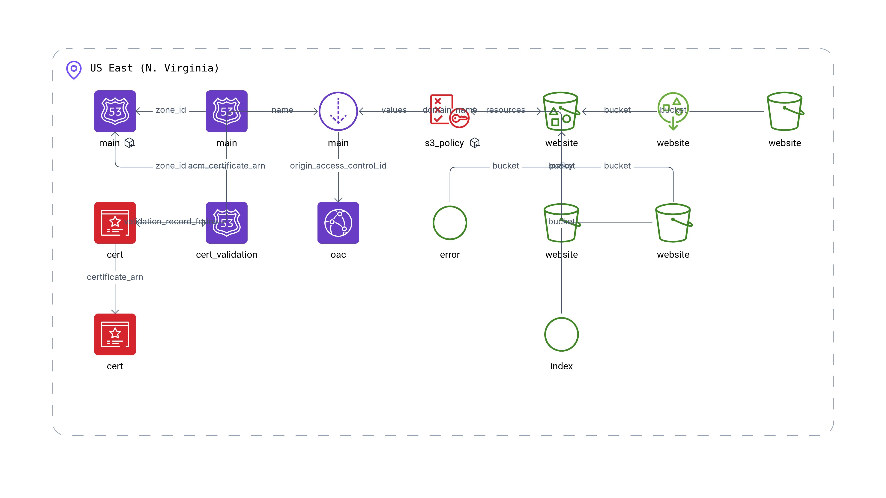

## Static Website on S3 + CloudFront + WAF (AWS)

This Terraform configuration provisions a secure static website stack:
- Private S3 bucket with website configuration (access only via CloudFront OAC)
- CloudFront distribution with HTTPS (ACM), security response headers, and logging
- AWS WAFv2 Web ACL with managed rules, rate limiting, and logging to S3 via Firehose
- Route 53 alias record to your CloudFront distribution
- `index.html` and `error.html` uploaded to the S3 bucket

> Note: Remote state is configured in `backend.tf` to an S3 bucket. Ensure it exists or adjust before running.

### Prerequisites
- Terraform v1.3+
- AWS credentials configured
- A public hosted zone in Route 53 matching `var.domain_name`
- Ownership/control of the domain in Route 53 to validate ACM

### Quick start
```bash
cd static-website

# Optionally customize domain in a tfvars file
cat > static-website.auto.tfvars <<'EOF'
domain_name = "example.com" # must exist in Route 53 hosted zones
EOF

# Initialize (ensure S3 backend in backend.tf exists or update it)
terraform init

# Review
terraform plan -out tfplan

# Apply
terraform apply tfplan
```

### After apply
- Wait for ACM validation to complete (DNS record is created automatically). CloudFront will deploy once the certificate is validated.
- Fetch outputs:
  - `cloudfront_domain` – access the site at `https://<cloudfront_domain>` while DNS propagates
  - `s3_bucket_name` – your website bucket
- Once Route 53 alias is live, access at `https://<domain_name>`.

### Inputs
- `domain_name` (string) – Domain for the website (must be in Route 53). Default: `211125418662.realhandsonlabs.net`

### Outputs
- `cloudfront_domain` – CloudFront distribution domain
- `s3_bucket_name` – Website S3 bucket name

### Security controls
- S3 bucket is private with ownership controls, versioning, SSE-S3, and public access block
- CloudFront enforces HTTPS, injects strict security headers, and logs to S3
- WAFv2 Web ACL with:
  - AWS managed rule groups (Common, SQLi, KnownBadInputs)
  - Rate limiting rule
  - Logging to S3 via Firehose
- OAC-based S3 access; bucket policy allows only the CloudFront distribution

### Architecture and flow
1. Users resolve `var.domain_name` → Route 53 alias to CloudFront
2. CloudFront serves from S3 origin using Origin Access Control (no public S3)
3. WAF filters malicious traffic; CloudFront adds security headers and enforces TLS 1.2+
4. Access logs and WAF logs flow to dedicated S3 buckets

### Remote state
Defined in `backend.tf`:
```hcl
backend "s3" {
  bucket = "my-terraform-state-bucket-381492134996"
  key    = "terraform-playground-static-website.tfstate"
  region = "us-east-1"
}
```

### Destroy
```bash
terraform destroy
```

### Diagram
